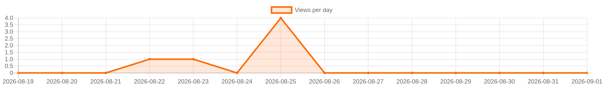

<!-- LANG_START -->
🇬🇧 [English version](README.en.md)
<!-- LANG_END -->

<!-- STATS_START -->
<!-- auto-updated by GitHub Actions · 2026-09-02 19:19 UTC -->

[](https://github.com/gooog1111/OrcheRoute)
[](https://github.com/gooog1111/OrcheRoute)
[](https://github.com/gooog1111/OrcheRoute)
[](https://github.com/gooog1111/OrcheRoute)
[](https://github.com/gooog1111/OrcheRoute/stargazers)
[](https://github.com/gooog1111/OrcheRoute/network/members)
[](https://github.com/gooog1111/OrcheRoute/releases/latest)
[](https://github.com/gooog1111/OrcheRoute/releases)

<!-- STATS_END -->

<!-- GRAPH_START -->
<p align="center">
  
</p>
<!-- GRAPH_END -->

<!-- ISSUES_START -->
<!-- auto-updated by GitHub Actions · 2026-09-02 19:19 UTC -->

## Issues

<p>
  <a href="https://github.com/gooog1111/OrcheRoute/issues">
    
  </a>
  <a href="https://github.com/gooog1111/OrcheRoute/issues/new/choose">
    
  </a>
</p>

<details open>
<summary><b>Открытые issues</b></summary>


<p align="center">
  <b>Открытых issues нет.</b><br>
  <sub>Служебный issue <code>views-counter</code> скрыт из списка.</sub>
</p>


</details>

<p>
  <a href="https://github.com/gooog1111/OrcheRoute/issues/new/choose">Создать issue</a> ·
  <a href="https://github.com/gooog1111/OrcheRoute/issues">Все issues</a>
</p>

<!-- ISSUES_END -->

## OrcheRoute

OrcheRoute — VPN-клиент и контроллер маршрутизации на базе
[Mihomo](https://github.com/MetaCubeX/mihomo). Приложение принимает обычные
ссылки на серверы и подписки, проверяет доступность узлов, выбирает
рабочее соединение и направляет трафик по правилам `direct`, `proxy` и
`block`.

> Поддерживаемые цели проекта — Android `arm64` и Linux Server `amd64`.
> Остальные платформенные заготовки временно выведены из разработки, чтобы
> общий Go-код и два рабочих адаптера развивались без расхождений.

## Скачать

- **Текущая стабильная версия: 0.7.4** (Android `versionCode 85`)
- [Скачать APK для Android arm64](https://github.com/gooog1111/OrcheRoute/releases/download/v0.7.4/OrcheRoute-Android-0.7.4-code85-arm64.apk)
- [Скачать DEB для Linux Server amd64](https://github.com/gooog1111/OrcheRoute/releases/download/v0.7.4/OrcheRoute-Linux-Server-0.7.4-amd64.deb)
- [Страница последнего стабильного выпуска](https://github.com/gooog1111/OrcheRoute/releases/latest)
- [Все выпуски и beta-версии](https://github.com/gooog1111/OrcheRoute/releases)

Для Android требуется Android 8.0 или новее. Root-доступ не нужен.

1. Скачайте APK из последнего стабильного выпуска.
2. Разрешите установку из выбранного браузера или файлового менеджера.
3. При первом включении подтвердите создание VPN-подключения Android.
4. Разрешите уведомления и, если Android предложит, исключите OrcheRoute из
   энергосбережения — это помогает системе не останавливать VPN в фоне.
5. Добавьте собственную подписку в разделе «Подписки» или включите нужные
   встроенные аварийные источники.
6. Вернитесь на главный экран и нажмите «Включить».

Обновления устанавливаются из самого приложения через GitHub Releases. Для
обычных обновлений оставьте флажок «Beta-версии» выключенным.

### Linux Server

Устанавливайте скачанный DEB через APT, чтобы необходимые сетевые компоненты
были установлены автоматически:

```bash
sudo apt install ./OrcheRoute-Linux-Server-0.7.4-amd64.deb
```

При прямом `dpkg -i` WebUI также запускается, но для включения VPN-транспорта
потребуется установленный `nftables`. После установки адреса интерфейса и
сгенерированные данные входа выводятся в терминал и сохраняются в
`/etc/orcheroute/initial-credentials`.

В beta-канале Linux Server также доступен входящий VPN-сервер. Одна персональная
подписка содержит FreeTURN, VLESS Reality, Trojan TLS и Hysteria2; по умолчанию
используется SNI `m.vk.ru` и порты TCP 24443, TCP 24444 и UDP 24445.
FreeTURN принимает внешний TCP-трафик и передаёт его во встроенный Xray;
VLESS/Trojan/Hysteria2 listeners работают через изолированный экземпляр
комплектного Mihomo и не меняют действующую исходящую
маршрутизацию. Срок действия применяется ко всей подписке; счётчик трафика beta
пока учитывает только тракт FreeTURN.

`sudo apt remove orcheroute` сохраняет настройки, авторизацию, подписки,
маршруты и состояние. `sudo apt purge orcheroute` полностью удаляет эти данные
и резервные копии OrcheRoute.

## Что умеет OrcheRoute

- добавлять подписки, отдельные серверы, файлы, списки из буфера и QR-коды;
- автоматически распознавать поддерживаемый формат подписки;
- отбрасывать дубликаты серверов и повторяющиеся подписки;
- проверять серверы по этапам TCP, URL-test и speed-test;
- ранжировать рабочие серверы по задержке, скорости и стабильности;
- переключаться между основным и аварийным списками серверов;
- отдельно находить серверы, работающие при режиме «белых списков» оператора;
- применять маршруты по доменам, IP/CIDR, портам, протоколам, GeoIP и GeoSite;
- перехватывать обычные DNS-запросы внутри Android VPN и применять к ним
  выбранную маршрутизацию;
- обновлять GeoIP и GeoSite из выбранного источника;
- сохранять настройки, подписки и маршруты между перезапусками и обновлениями.
- менять общую для Android и Linux тему оформления: «Матрица», Hello Kitty,
  Liquid Glass, Windows 95, тёмную или светлую.

## Как работает автоматика

OrcheRoute независимо отслеживает состояние физической сети и различает три
состояния:

- **Интернет доступен.** Сначала используется лучший рабочий сервер основного
  списка. Если основных серверов нет, приложение переходит к аварийному списку.
- **Доступны только белые списки.** Приложение формирует отдельный список из
  серверов, реально доступных в ограниченной сети. Региональный фильтр при этой
  проверке не применяется, а весь трафик, кроме явно заблокированного, идёт через VPN.
- **Сети нет.** VPN отключается, чтобы не удерживать сломанный туннель, и
  восстанавливается после появления подходящей сети, если до аварии был включён.

В автоматическом режиме сервер удерживается до отказа. Ручной режим закрепляет
выбранный сервер, пока пользователь снова не включит автоматический режим.

## Маршрутизация

Правило можно направить в одно из трёх действий:

- `direct` — мимо VPN;
- `proxy` — через выбранный VPN-сервер;
- `block` — заблокировать соединение.

Поддерживаются отдельные IP-адреса, CIDR и диапазоны IP, доменные маски,
GeoIP/GeoSite, протоколы и независимые выражения портов, например `:5000`,
`:5000-6000` или `:5000,5002,5005`.

Перед применением нестандартных правил оставьте доступ к локальной сети и самому
VPN-серверу: ошибочное правило `block` или `direct` может сделать соединение недоступным.

## Используемые проекты и встроенные источники

### Сетевое ядро

- [MetaCubeX/mihomo](https://github.com/MetaCubeX/mihomo) — обработка TUN,
  прокси-протоколов, DNS и правил маршрутизации. В Android ядро встроено в APK;
  его версия обновляется вместе с приложением.

### Транспорт FreeTURN

- [samosvalishe/free-turn-proxy](https://github.com/samosvalishe/free-turn-proxy)
  используется как единый клиентский и серверный FreeTURN runtime;
- в `third_party/free-turn-proxy` зафиксирована проверенная upstream-ревизия
  с минимальным патчем изоляции отказов независимых VK Call-провайдеров.

Авторы, лицензия и исходная ревизия указаны в `THIRD_PARTY_NOTICES.md`.
Прежний собственный VKCall/DTLS/KCP/smux тракт удалён.

### Встроенные аварийные списки серверов

При чистой установке доступны два публичных источника. Их можно выключить в
разделе «Подписки»:

- [EbraSha/free-v2ray-public-list](https://github.com/ebrasha/free-v2ray-public-list)
  — [используемый список серверов](https://raw.githubusercontent.com/ebrasha/free-v2ray-public-list/refs/heads/main/V2Ray-Config-By-EbraSha.txt);
- [Au1rxx/free-vpn-subscriptions](https://github.com/Au1rxx/free-vpn-subscriptions)
  — [используемая V2Ray/Base64-подписка](https://raw.githubusercontent.com/Au1rxx/free-vpn-subscriptions/main/output/v2ray-base64.txt).

Эти репозитории не принадлежат OrcheRoute. Состав, доступность и безопасность
публичных серверов контролируются их авторами и владельцами узлов. Рассматривайте
их как аварийный резерв: для постоянной работы лучше добавить собственную доверенную
подписку. Не передавайте чувствительные данные через неизвестные серверы без прикладного
шифрования, например HTTPS.

## GeoIP и GeoSite

Приложение поддерживает три готовых источника:

- [MetaCubeX/meta-rules-dat](https://github.com/MetaCubeX/meta-rules-dat) —
  [GeoIP](https://github.com/MetaCubeX/meta-rules-dat/releases/download/latest/geoip.dat)
  и [GeoSite](https://github.com/MetaCubeX/meta-rules-dat/releases/download/latest/geosite.dat);
- [RunetFreedom/russia-v2ray-rules-dat](https://github.com/runetfreedom/russia-v2ray-rules-dat) —
  [GeoIP](https://raw.githubusercontent.com/runetfreedom/russia-v2ray-rules-dat/release/geoip.dat)
  и [GeoSite](https://raw.githubusercontent.com/runetfreedom/russia-v2ray-rules-dat/release/geosite.dat);
- [Loyalsoldier/v2ray-rules-dat](https://github.com/Loyalsoldier/v2ray-rules-dat) —
  [GeoIP](https://github.com/Loyalsoldier/v2ray-rules-dat/releases/latest/download/geoip.dat)
  и [GeoSite](https://github.com/Loyalsoldier/v2ray-rules-dat/releases/latest/download/geosite.dat).

Также можно указать собственные прямые HTTPS-ссылки на совместимые
`geoip.dat` и `geosite.dat`. Одновременно используется один выбранный набор.

## Данные и разрешения Android

Настройки, маршруты и импортированные подписки хранятся локально в данных
приложения. OrcheRoute не требует регистрации. Для работы приложению необходимы доступ к
сети, системное разрешение VPN, foreground-уведомление и доступ к камере только при сканировании
QR-кода.

Удаление приложения удаляет его локальные данные. Перед переустановкой с другим
сертификатом подписи экспортируйте важные подписки и серверы.

## Ограничения

- стабильный Android APK сейчас публикуется только для `arm64`;
- доступность бесплатных серверов и подписок не гарантируется;
- некоторые прошивки Android агрессивно закрывают фоновые приложения даже после
  выдачи разрешений;
- передача VPN в мобильную точку доступа зависит от реализации прошивки Android и без
  системных прав может быть недоступна;
- Linux Server и Android используют разные системные транспортные адаптеры;
  их общий функционал последовательно переносится в единые Go-модули.

## Документация для разработки

- [API.md](API.md) — локальный HTTP API;
- [ANDROID_ARCHITECTURE.md](ANDROID_ARCHITECTURE.md) — устройство Android-приложения;
- [THIRD_PARTY_NOTICES.md](THIRD_PARTY_NOTICES.md) — сторонние компоненты и лицензии.

## Локальная проверка и сборка

Единая точка входа проверяет только поддерживаемые цели — Android и Linux Server:

```powershell
.\scripts\build-all.ps1 -Target all
```

На Windows Android собирается локально, а Linux Server — в WSL
`Ubuntu-24.04`. Отдельные цели: `android`, `linux-server`, `web` и `common`.
На Linux используется `./scripts/build-all.sh all`. Сборка через GitHub Actions
в проекте запрещена.

Актуальная разработка ведётся в единственной ветке `main`. Стабильные версии
зафиксированы тегами `v*`, а тестовые Android-сборки — тегом `android-beta`.
Сборки и проверки выполняются только локально; workflow GitHub Actions удалены.

## Лицензии и авторство

OrcheRoute использует сторонние проекты и данные на условиях их собственных лицензий.
Ссылки выше ведут на исходные репозитории, где указаны авторы, лицензии и правила
использования каждого компонента.
